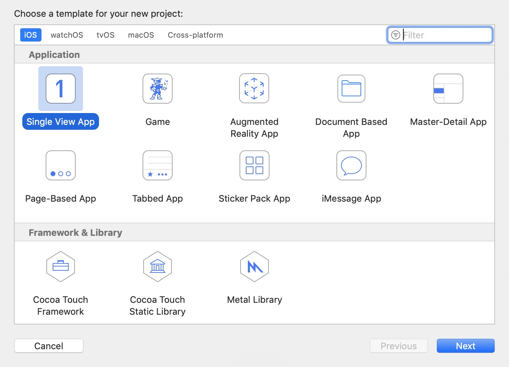
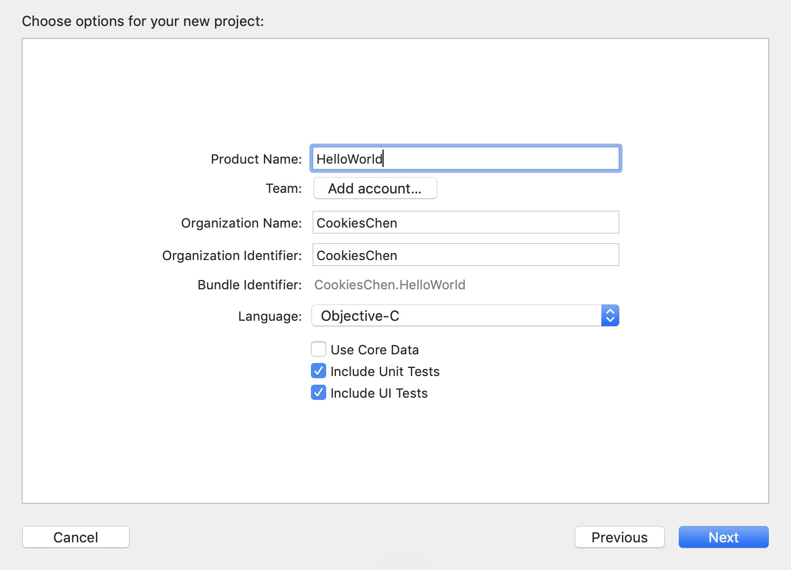
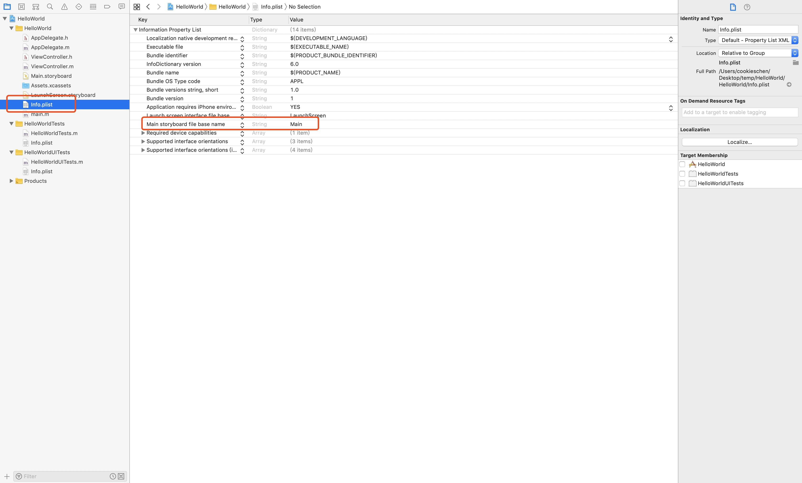
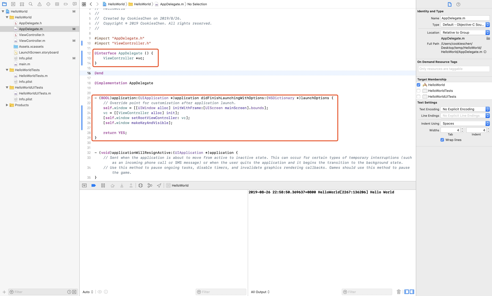
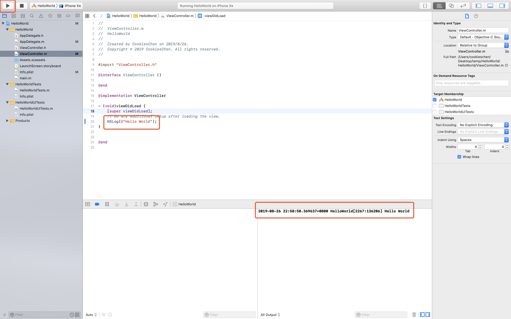

## Xcode入门

###  开发环境

* Mac OS
* Objective-C
* Xcode

### 前言

本文主要讲述构建第一个Xcode项目，不使用storyboard和xlib进行布局（实践中很少使用）。

* storyboard：一旦Xcode打开，该文件就会发生改变，在团队开发时会引起很多冲突，维护成本太高。
* xlib：不利于多人协作。

### 创建项目

1、打开Xcode，点击Create a new Xcode project，选择模版（每个模版都提供了一套程序，作用是简化开发，这里选最简单的 Single View Application模版。



2、填写模版选项



3、选择项目存放位置（是否勾选创建Git repository，默认即可，是一个版本控制器，适合多人协作开发）

4、删除Main.storyboard，并且清除info.plist配置文件中的入口



5、接下来找到`AppDelegate.m`文件，`UIApplication`为App的根对象，每个App对应一个`UIApplication`，实现了`UIApplicationDelegate`的对象为开发者提供控制app生命周期内的接口。这里我们找到app启动之后的入口函数，在这里我们初始化UIWindow（这里先不做介绍，后续有兴趣可深入了解，悬浮球可以用UIWindow实现），UIWindow为视图的容器，我们将其设置为屏幕大小。我们引入了ViewController，初始化了一个视图控制器，并且将其设置为window的根视图控制器。最后将window设置为key window并且可视化。



6、找到viewcontroller，该类继承自UIViewController（有固定的生命周期），这里我们在viewDidLoad函数中（生命周期函数）中输出“Hello World”。运行程序启动模拟器之后，可以在控制台中可以观察到输出。

```objc
//
//  ViewController.m
//  HelloWorld
//
//  Created by CookiesChen on 2019/8/26.
//  Copyright © 2019 CookiesChen. All rights reserved.
//

#import "ViewController.h"

@interface ViewController ()

@end

@implementation ViewController

- (void)viewDidLoad {
    [super viewDidLoad];
    // Do any additional setup after loading the view.
    NSLog(@"Hello World");
}


@end

```

