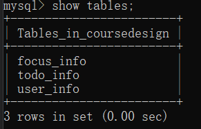
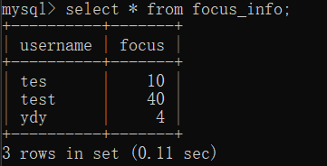
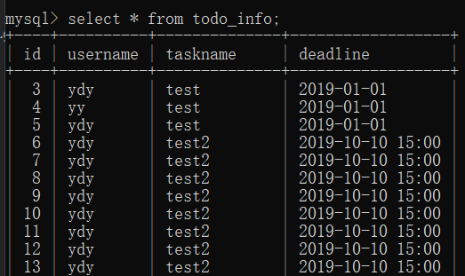
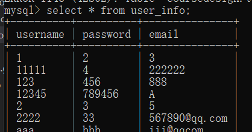
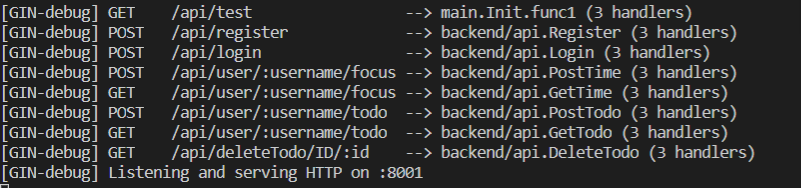
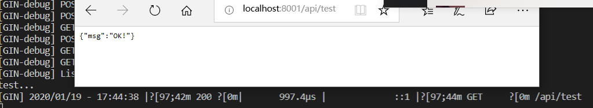

# 中山大学数据科学与计算机学院本科生实验报告
## （2019年秋季学期）
| 课程名称 | 手机平台应用开发 | 任课老师 | 郑贵锋 |
| :------------: | :-------------: | :------------: | :-------------: |
| 年级 | 2019级 | 专业（方向） | 软件工程计应方向 |
| 学号 | 17343141 | 姓名 | 姚东烨 |
| 电话 | 13246859092 | Email | 894816193@qq.com |
| 开始日期 | 2019.12 | 完成日期 | 2020.01

---

## 一、实验题目
## 期末项目——TimeTodo

---

## 二、实现内容
### 本人负责的应用的实现部分：
    参与项目的构思与测试
    负责服务端的设计

---

## 三、实验结果
### (1)实验截图













### (2)实验步骤以及关键代码

- **配置环境**

  本次实验，我使用到的是 **gin框架** ，**gorm** 以及 **MySQL** 来实现后端开发

  使用 **go get** 来对所需要的包进行抓取

  所需包具体如下：

  ```
  "github.com/jinzhu/gorm"
  "github.com/gin-gonic/gin"
  "github.com/jinzhu/gorm/dialects/mysql"
  ```

  **Mysql** 使用的 5.7 的版本，需要去官网自行下载

- **实现API**

  需要建立3个数据库：

  > user_info：记录用户信息
  >
  > focus_info：记录专注时间信息
  >
  > todo_info：记录待办事项信息

  接着设置路由：

  ```
  be_api.POST("/register", api.Register)
  be_api.POST("/login", api.Login)
  be_api.POST("/user/:username/focus", api.PostTime)
  be_api.GET("/user/:username/focus", api.GetTime)
  be_api.POST("/user/:username/todo", api.PostTodo)
  be_api.GET("/user/:username/todo",api.GetTodo)
  be_api.GET("/deleteTodo/ID/:id", api.DeleteTodo)
  ```

  为每一个路由方向设计对应的处理函数

  涉及到的都是数据库的操作，以及处理请求、发回响应的操作。这里以注册操作为例子，其他的处理函数都大同小异，不再赘述。

  ```go
  func Register(c *gin.Context) {
  	var receive static.UserInfo
  	c.BindJSON(&receive)
  	//get dataBase
  	db, err := gorm.Open("mysql", "root:root@tcp(127.0.0.1:3306)/CourseDesign?charset=utf8")
  	db.SingularTable(true)
  	if err != nil {
  		fmt.Println(err)
  	//	panic("Open DB error!")
  	}
  	defer db.Close()
  	db.AutoMigrate(&static.UserInfo{})
  
  	//check whether if duplicate
  	var duplicate static.UserInfo
  	db.Where(&receive).First(&duplicate)
  	db.Where("username = ? OR email = ?", receive.Username, receive.Email).First(&duplicate)
  	if duplicate==(static.UserInfo{}){
  		db.Create(&receive)
  		c.JSON(http.StatusOK, gin.H{
  			"status":  "success",
  		})
  	}else{
  		c.JSON(http.StatusOK, gin.H{
  			"status":  "fail",
  			"err_msg": "Your username or email is duplicate",
  		})
  	}
  }
  ```

  首先需要将 **gin.Context** 与用来接受的结构体绑定，接着打开数据库，按照接收到的数据进行查询操作。查询完毕后，根据查询结果，返回成功/错误信息。

  **注：** 具体API设计文档在上一层文件夹中

- **测试**

  使用Postman进行测试。测试包括：

### (3)实验遇到的困难以及解决思路

1. 环境配置问题

   使用到的有些包需要科学上网后才能抓取，否则会一直报超时的错误。解决方法是让同学帮忙下载，再按照路径存到自己的环境中。

2.  数据库使用问题

   若是连接了数据库但是不进行关闭的话，将会影响到后面程序对数据的操作。一开始一直以为是数据库没有收到请求，后面通过查询gin的使用教程，使用了一个defer close来解决这个问题。

3.  测试问题

   由于我们计算机默认开启了防火墙，所以在一开始测试的时候，总是收不到前端同学发来的请求，后来尝试关闭所有防火墙，这样就可以收到请求了。

4.  GET参数获取问题

   在开始实验的时候，我只懂得使用自定义结构体绑定Context来获取post的表单，但是在实际应用中，会出现在get中获取参数的问题，通过查询gin的使用手册，我了解到可以直接使用Context的Param来获取参数。

5. 还有一些小细节问题就不在这里一一赘述了

---

## 四、课后实验结果

​		前后端之间的通信正常，前端能通过预先约定好的API获取所需的正确的数据，具体测试视频链接：

> https://gitee.com/mosadfenzu16/MOSAD_HW_Final/blob/master/report/演示视频.mp4

## 五、实验思考及感想

​		做完这次iOS大作业后，就代表现代操作系统这门课程结束了。由于在第七次课程作业中，老师为我们介绍了以go语言为基础的服务端设计。所以在本次大作业中，我也选择了做后端设计，以将自己刚学到的知识运用到实践中。

​		Gin是一个十分好用的框架，之前我所学到的网络通信就是服务端和客户端分别建一个socket，接着就通过socket来通信就可以了。但是这并不符合Restful的设计观念。我们应该设计路由，让路由帮我们选择所需要到达的处理函数，接着再使用这个处理函数对前端发来的请求进行处理。

​		出去Gin以外，本次实验我又重拾了上学期学过的数据库的知识。在上学期的课程中，我们使用的都是MySQL来辅助学习。所以对于SQL语句，我还是比较熟悉的。而Gorm封装了数据库而提供了相应的API来让我们查询，修改数据，这大大方便了我的操作。一开始看Gorm的教程的时候确实会觉得有一些晦涩难懂，因为我从来都没有碰过ORM相关的东西。在后来慢慢打开数据库，并跟着教程一步一步做了之后，就渐渐地能理解Gorm应该如何被使用，接下来的正是编程就变得顺畅了许多。

​		有遗憾的是，在本学期中，我们学到的大部分知识都是iOS端的，但是在最终的课程设计中，我完全地投入到了后端的设计中。没能设计出属于自己的一个页面，我认为这是比较遗憾的事情。

​		总而言之，通过本学期的学习，我对iOS的开发有了一点基本的了解，也能自己做一些小小的设计，不过到目前为止我们学到的都只是iOS开发中的一点皮毛，希望自己能在接下来的寒假中制定好学习计划，继续钻研iOS的有关知识，争取运用到之后的工作学习中。最后感谢老师和TA们的耐心指导，让我收获良多。