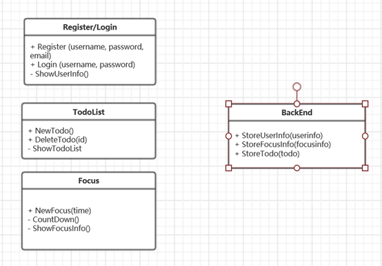

# TIME TODO

 

**组员信息：**

|   学号   |  姓名  |
| :------: | :----: |
| 17343141 | 姚东烨 |
| 17343131 | 许滨楠 |
| 17343064 | 李僖哲 |
| 17343140 | 杨泽涛 |

 

 

 

**应用简介**

应用包含用户代办事项提醒，用户专注时间记录的功能，起到了帮助用户管理时间以及提高专注度的作用。用户可在TodoList页面设置自己当前需要做的事项，并在工作的时候到Focus页面设置自己预计专注的时间。当用户完成专注时间后，应用会向服务端发送数据，记录用户已完成的专注时间记录，并将反馈到页面中，让用户知道自己总共专注了多长时间，以此加强用户专注工作的动力。

 

**应用架构**

 

**应用类图**

****

 

**时序图**

****

 

**前端设计**

- **TodoList**

  > 主要采用的技术是原生的UITableView组件，辅以自定义Cell样式和方法，完成了点击完成和拖拽完成两种功能，之所以采用这个组件的主要原因是这是课上讲过的组件，并且可以比较好的完成期待的效果，所以就采用了UITableView原生组件。
  >
  > 网络编程方面采用的技术是**基于NSURLSession的网络访问**，这也是课上讲授过的组件，并且使用还算比较方便，所以就使用了它，但是它写出来的代码比较冗余，一开始没有很好地针对这点作优化，导致代码结构比较混乱。
  >
  > 为了实现页面刷新的效果，我还使用了 **基于GCD的多线程操作**，主要是用它来实现一些异步刷新的效果，它的使用比较简单，逻辑清晰，所以我选择了它。

- **Focus**

  > 这部分功能同样使用 Objective-C 编写，大部分使用原生组件实现，包括基本的 UI 视图组件、文字布局、苹果时间选择器组件（这是应用这部分功能的主体），还有基本的网络访问（实现中使用 OC 的 NSURLSessionDataDelegate 协议完成），同时还做了简单的动画效果以提高用户体验，实现在专注时长之中的水波动画效果，圆圈中的水波会随着用户专注时间的持续持续上涌，直到用户专注时间完成填满整个圆形容器。同时，为了加强页面的功能性，我在用户专注的时候添加了网络接口访问，从网络上获取一些激励的名言警句显示在用户界面下方，并且每十秒钟就会重新获取更新。
  >
  > 总的来说，使用的小技术点有：
  >
  > - 原生简单组件实现页面布局，性能高，样式调整之后效果好；
  > - 专注时间相关使用原生 UIDatePicker 加上第三方插件辅助，实现用户专注时长选择以及专注动画；
  > - 语录部分通过 NSURLSession 协议完成网络访问，获取语录并显示。

- **Register/Login**

  > 采用技术：
  >
  > 使用`Objective-C`语言进行项目的设计，用到了该语言的一些类与技巧
  >
  > - ##### 懒加载
  >
  >   这是一种独特而又强大的数据获取方法,它能够在用户滚动页面的时候自动获取更多的数据,而新得到的数据不会影响原有数据的显示,同时最大程度上减少服务器端的资源耗用。
  >
  >   使用原因：
  >
  >   1. 不必将创建对象的代码全部写在`viewDidLoad`方法中，代码的可读性更强。
  >   2. 只有当真正需要资源的时候，再去加载，节省了内存资源。
  >
  > - ##### Cell重用
  >
  >   它可以从缓存池中取相应identifier的Cell并更新数据，如果没有，才开始分配新的Cell，并用`identifier`标识Cell。每个Cell都会注册一个`identifier`（重用标识符）放入缓存池，当需要调用的时候就直接从缓存池里找对应的id，当不需要时就放入缓存池等待调用。
  >
  >   使用原因：
  >
  >   - 避免大量创建实例对象，减少`Memory Warning`内存的消耗甚至`Crash`掉，从而提高滑动流畅性，提高用户体验。
  >
  > - ##### 使用hidden隐藏与显示
  >
  >   由于我只定义了一种Cell，但是又要显示不同的子页面，所以我把所有不同类型的view都定义好，放在cell里面，通过hidden显示、隐藏，来显示不同类型的内容。毕竟，在用户快速滑动中，只是单纯的显示、隐藏subview比实时创建要快得多。
  >
  >   使用原因：
  >
  >   - 加快页面加载，提高用户体验。
  >
  > - ##### 使用dispatch_group来进行线程同步
  >
  >   由于注册与登录的时候需要与数据库进行数据交互，为了确保在注册或者登录之后切换页面的时候想要的数据已经全部获取到，所以需要使用线程同步的技术。利用`dispatch_group_enter(group)`, `dispatch_group_leave(group)`, `dispatch_group_notify`来确保数据获取完毕。（当调用enter时计数加1，调用leave时计数减1，当计数为0时会调用dispatch_group_notify）
  >
  >   使用原因：
  >
  >   - 避免用户数据未获取完毕导致用户个人信息显示错误
  >
  > 

 

**后端设计**

​	**采用技术：**

> **Go语言：** 该语言非常适合服务端开发，它有着快速的编译时间，开发效率以及运行速率很高。Go语言的标准库十分稳定，当我们需要使用其他库的时候使用简单的**go get**指令，再将其引入到项目中即可。并且，在本学期的服务计算课程中，我们大量地学习Go语言的开发技术，所以在本次项目中，我是用Go语言搭建服务端。
>
> **Orm框架：** Orm就是Object-Relational Mapping，它的作用是在关系型数据和对象中建立映射，那么当我需要和数据库交互的时候，就不用再写冗杂的SQL语句，而可以直接操作“数据库对象“，这样会使得程序更直观易读，也节省了开发时间。这里我使用的是用Go写的Gorm。
>
> **MySQL数据库：** 我们需要数据库来做持久化处理，所以我选择了大二时候数据库课程中学习的MySQL数据库，这个数据库是一个功能强大的老牌数据库系统了。
>
> **Gin框架：** 这是一个用Go写的web框架，它有点像martini，但是有着更好的性能。而且Gin的使用十分简单，在本实验中，我们只需要设置好设置好路由，并以此分配handler就可以了。

 

**成员贡献表及Git提交记录**

| 成员            | 贡献                   |
| --------------- | ---------------------- |
| 17343140 杨泽涛 | TodoList页面设计       |
| 17343131 许滨楠 | Focus页面设计          |
| 17343064 李僖哲 | Register/Focus页面设计 |
| 17343141 姚东烨 | 后端设计               |

**应用部署方法**

> **本地部署，需要Go环境**
>
> **所需库：**
>
> - "github.com/jinzhu/gorm"
>
> - "github.com/jinzhu/gorm/dialects/mysql"
>
> - "github.com/gin-gonic/gin"
>
>   **需要使用MySQL数据库，并且开启服务**
>
>   **端口：8001**

 

**应用测试结果**

> 视频链接：https://gitee.com/mosadfenzu16/MOSAD_HW_Final/blob/master/report/演示视频.mp4

