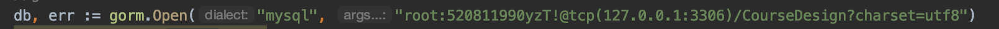
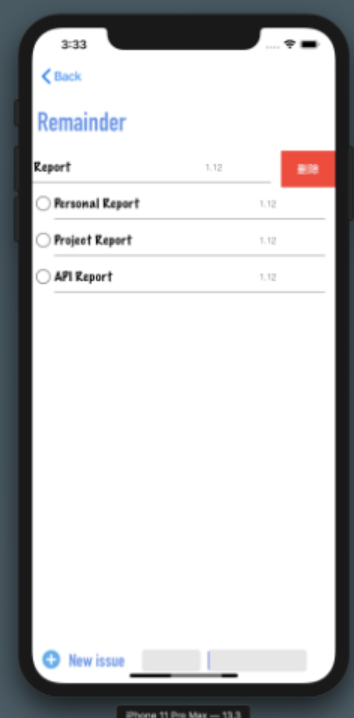
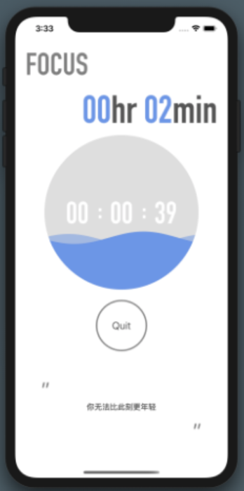

# **使用手册**

1. 使用前的准备工作：配置好MySQL环境，并且建立表CourseDesign。后端代码需要修改的地方有MySQL连接部分，需要配置填写正确的用户名和密码以及监听端口，例如：

   前端代码需要修改的地方有IP地址（改成本机IP），例如：

   

2. 开启go后端，编译并运行前端，界面显示如下：

   

   即可进行正常的注册登录，登录之后有界面如下：

   

   可以选择退出，或者点击进入两个子页面（本页面即可显示提醒事项的数目和专注时长）。

   进入提醒事项页面后显示如下：

   

   一开始本页面为空，用户在右下角两个输入框中输入提醒事项内容和DDL（分别对应左右两个框），之后点击➕按钮即可添加事项，页面会自动刷新，删除提醒事项的操作有两种，第一个是直接点击左侧圆框，等待一秒后事项会自动完成，第二种是向左拖拽事项，点击删除即可。

   进入专注页面显示如下：

   

   通过旋钮选择专注时长即可开始专注工作，工作过程中动画会呈现波浪效果。

   