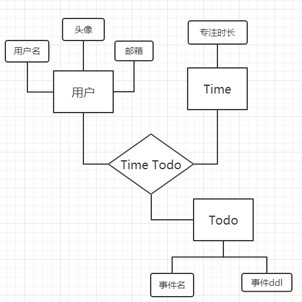
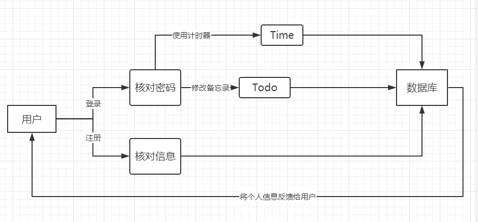
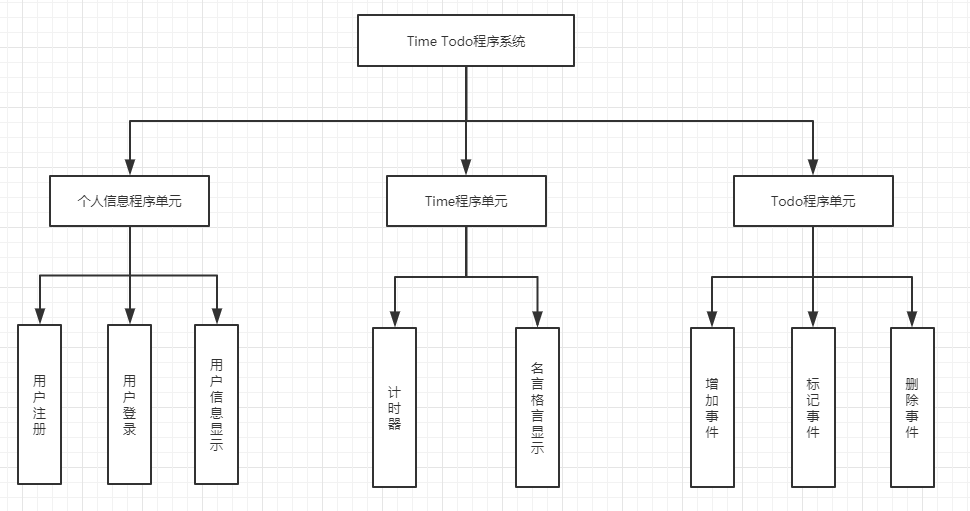

# Time Todo项目需求分析与设计文档

### 构思思路

随着生活的发展，大大小小的事件应接不暇，同时手机的逐步普及让纸张逐渐淡出了我们的生活，为了能够让大家避免忘记这些零零碎碎的事情，我们就想设计一款能够记录这些待办事项的APP。但与此同时，手机的出现也让不少人过度沉迷于一些游戏、图文社交平台，但浏览的这些信息大部分都是无效的，所以我们构想出了一个计时器，专门记录用户的专注时间，让用户知道他们有多少时间是花在学习、工作等事情上的。

### 需求分析

- 功能需求

  1. 用户：实现登录、注册功能、展示个人信息
  2. 数据库连接：与前端进行数据交互
  3. Time：能够记录用户专注时间
  4. Todo：实现对备忘录事件的增加与删除

   

- 非功能需求

  1. 性能需求：要在`IOS`系统上运行
  2. 易用性、易学性：操作简便，容易上手，能够让用户在阅读用户使用手册之后顺利使用
  3. 用户界面：界面简洁美观，对用户友好，让用户清楚地知道每一步应该做什么。

### 设计过程

- 用户信息管理数据模型：E-R图

  

   

- 用户使用各种功能过程：数据流传递图

  

   

- 系统层次模块图

  

- 系统说明：本系统可以提供用户记录自己的专注时长、增减Todo List里面的事件
- 用户手册：详见用户手册文档